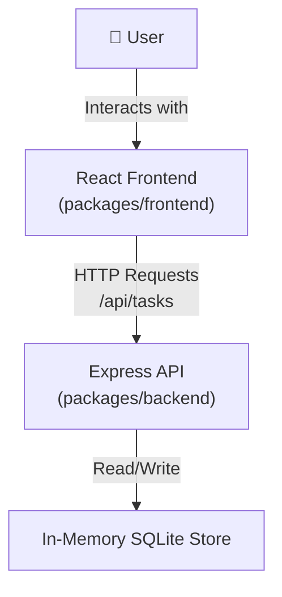
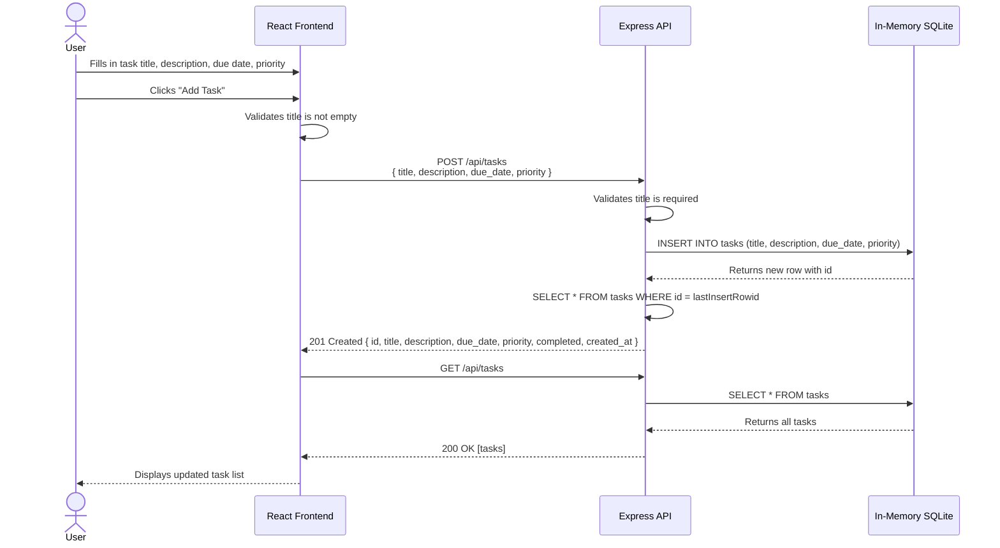

# Cloud Architecture Overview

## System Context

The TODO application is a monorepo consisting of a React frontend, an Express API backend, and an in-memory SQLite data store. The user interacts with the React UI in the browser, which communicates with the Express API over HTTP. The API reads and writes task data to the in-memory store.

## Sequence Diagram: Creating a TODO

The following diagram shows the end-to-end flow when a user creates a new task.

